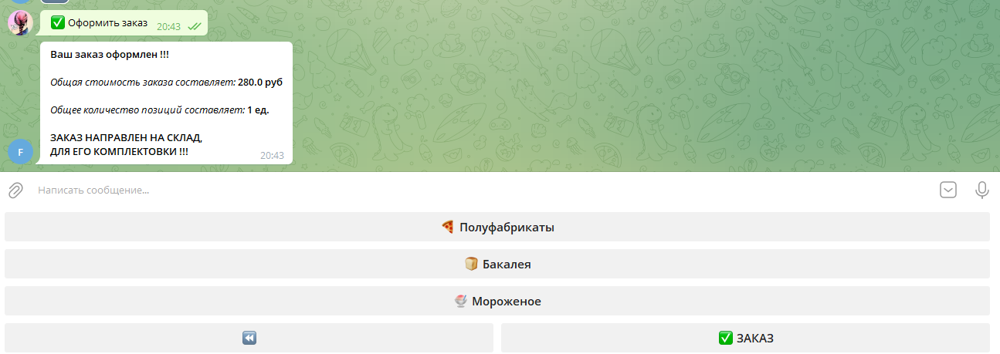

# store_telegram_bot
telegram бот, имитирующий простейшее управление магазином  

## Интерфейс
1. Возможность просмотреть информацию о магазине, настройки и приступить к выбору товара  

  

2. Просмотр информации о магазине, возможность вернуться на стартовую страницу  

  

3. Выбор категории продукта в нижнем меню, выбор продукта и добавление его в заказ в инлайн меню  

  

4. Просмотр информации по товарам в заказе, возможность переходить между позициями заказа и изменять количество единиц товара, возможность оформить заказ  

5. Заказ отпрален на склад, выведена информация о заказе  

  

## Запуск проекта
1. Клонировать репозиторий
2. Установить зависимости pip install -r requirements.txt
3. В директории store_telegram_bot\setttings заполнить файл .env.template (токен телеграмм бота) и переименовать его в .env
4. Для создания тестовой базы данных и наполнения ее данными можно запустить скрипт store_telegram_bot\data_base\create_and_fill_DB.py
5. Запустить скрипт store_telegram_bot\telegram_bot.py